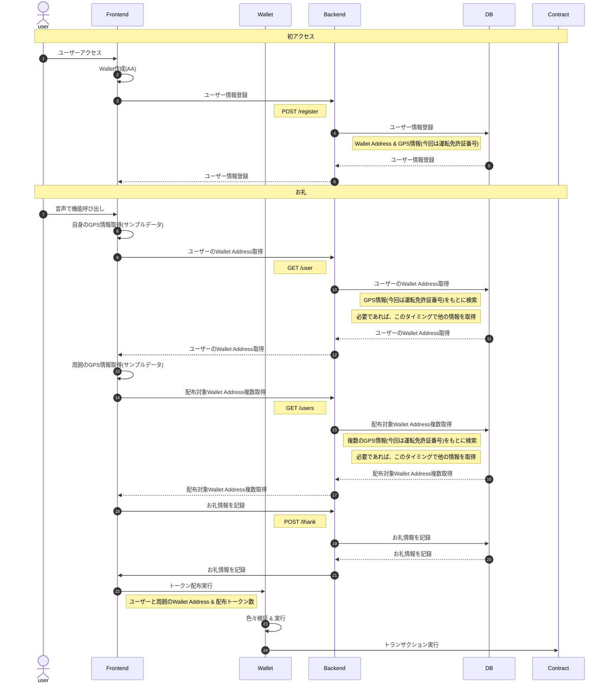

# Pigeon

## About
「**Pigeon**」
は、平和の象徴と伝書鳩の意味を込めて名付けられました。

相手とコミュニケーションが取れないと感謝を伝えることもできません。

そこで私たちは、道を譲ってくれたなどの「感謝」を伝えたい時に利用するプロダクトを開発しました。
その感謝は、運転中でも音声で起動でき、リアルタイムで伝えることができます。

また、位置情報とブロックチェーンを掛け合わせ、自分の周りの人たちに一斉に「感謝」を送ることができます。

感謝は、トークンとして送られるため、アイデンティティとして残るだけでなく、実際の店舗やETCの支払いポイントなどに利用することができます。
感謝されるような良い行いにはインセンティブをつけることで、良い行いを増やすという、ビットコインのような思想も含まれています。

## Product

| Environment | Link | Description |
| :---------: | :--: | :---------: |
| Development | https://key3-hackathon-drive.vercel.app/ | 開発環境 |
| Production | www.drive-pigeon.com | 本番（公開予定） |

## Product 紹介動画

https://github.com/ponponnsan/key3_hackathon_drive/assets/61935109/40001dc3-9093-40e0-974f-60a91aa0a079

## DEMO動画

## 課題
車社会は「社会」と名付けられているけれど、お互いにコミュニケーションをとることが難しく、
相手が見えなかったり、乗り物に乗っているということもあり、イライラすることが多いです。

その中で、ブロックチェーンを利用した、コミュニケーションツールとして、「Pigeon」は開発されました。

ブロックチェーンを利用した理由は、道を譲ったりした人＝車社会として良いことをした人
に対して、トークンを付与することができます。
そのトークンは、永続的にブロックチェーンに保存され、「良いことをした履歴」をブロックチェーンに残すことができます。

## 機能一覧
開発段階の画面での機能紹介です。

### Sign Up

| 登録ボタン | 免許証登録 |
| :------: | :-------: |
|  |  |
| Sign Upスタート画面。 | 免許証を入力する画面。 |

| 登録成功モーダル |
| :-----------: |
|  |
| AA Walletが作成されたのち表示されるモーダル。 |

### Account

| アカウント |
| :-------: |
|  |
| ユーザー情報を表示する画面。 |

### Notice

| 通知 | Google Map |
| :-: | :--------: |
|  |  |
| 「ありがとう」を受け取った履歴を表示する画面。 | 「ありがとう」を受け取った場所を表示する画面。 |

### History

| 履歴 |
| :-------: |
|  |
| 「ありがとう」の送受信の履歴画面。 |

### Token

| 送付画面 | 音声認識 |
| :------: | :-------: |
|  |  |
| トークン送付スタート画面。 | 音声認識スタート画面。 |

| 送付指示 | トークン送付 |
| :------: | :-------: |
|  |  |
| 音声認識でトークン送付指示。 | トークン送付成功モーダル。 |

## 使用技術

| Category | Technology |
| :------: | :--------: |
| Frontend | Next.js |
| Frontend | TailwindCSS |
| Contract | Hardhat |
| Account Abstraction | Gelato |
| Account Abstraction | Safe |
| CI/CD | Github |
| Infura | Vercel |
| etc. | googlemap, webspeechapi |

## ディレクトリ構成

- [Doc](./docs/)
- [Frontend](./src/app/)
- [Contract](./src/app/contract)

## シーケンス図

