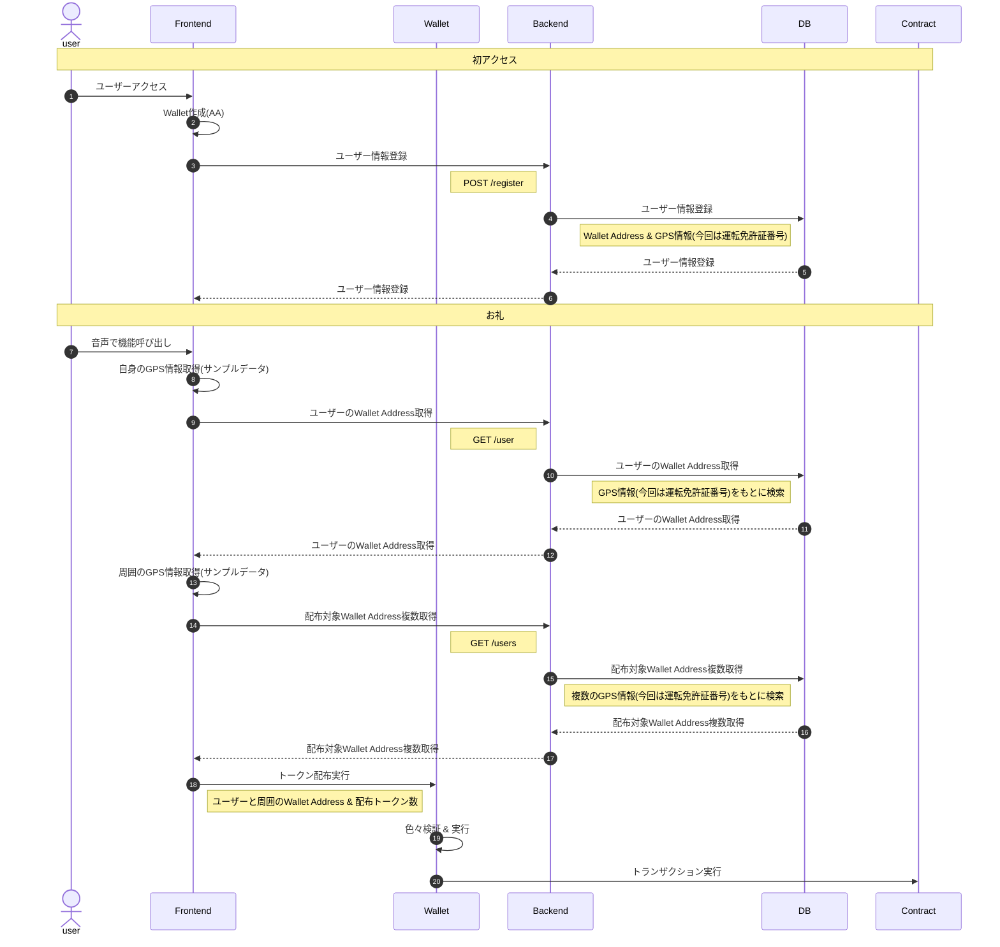

# User flow Sequence

- ユーザーのフローをシーケンス図にまとめました。

```mermaid
sequenceDiagram
    autonumber

    actor user
    participant frontend as Frontend
    participant wallet as Wallet
    participant backend as Backend
    participant db as DB
    participant contract as Contract

    Note over user,contract: 初アクセス
    user ->> frontend: ユーザーアクセス
    frontend ->> frontend: Wallet作成(AA)
    frontend ->> backend: ユーザー情報登録
    Note left of backend: POST /register
    backend ->> db: ユーザー情報登録
    Note left of db: Wallet Address & GPS情報(今回は運転免許証番号)
    db -->> backend: ユーザー情報登録
    backend -->> frontend: ユーザー情報登録

    Note over user,contract: お礼
    user ->> frontend: 音声で機能呼び出し
    frontend ->> frontend: 自身のGPS情報取得(サンプルデータ)
    frontend ->> backend: ユーザーのWallet Address取得
    Note left of backend: GET /user
    backend ->> db: ユーザーのWallet Address取得
    Note left of db: GPS情報(今回は運転免許証番号)をもとに検索
    db -->> backend: ユーザーのWallet Address取得
    backend -->> frontend: ユーザーのWallet Address取得
    frontend ->> frontend: 周囲のGPS情報取得(サンプルデータ)
    frontend ->> backend: 配布対象Wallet Address複数取得
    Note left of backend: GET /users
    backend ->> db:  配布対象Wallet Address複数取得
    Note left of db: 複数のGPS情報(今回は運転免許証番号)をもとに検索
    db -->> backend:  配布対象Wallet Address複数取得
    backend -->> frontend:  配布対象Wallet Address複数取得

    frontend ->> wallet: トークン配布実行
    Note left of wallet: ユーザーと周囲のWallet Address & 配布トークン数
    wallet ->> wallet: 色々検証 & 実行
    wallet ->> contract: トランザクション実行
```
